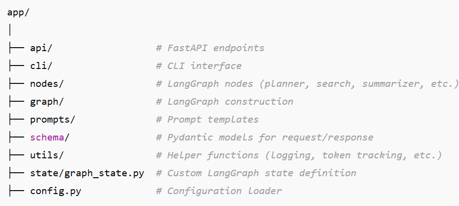
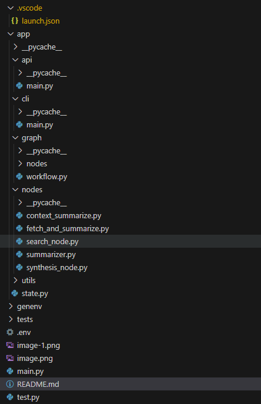

# 📘 Context-Aware Research Brief Generator

This project is an intelligent LangGraph-based pipeline that automates the generation of concise research briefs from a set of online sources. It leverages LLMs, LangChain components, LangSmith tracing, and modular LangGraph nodes to ensure explainability, observability, and scalability.

---

## ✨ Features

- 🔎 **Search Node**: Queries a user topic and fetches relevant content from the web.
- 🧠 **Summarizer Node**: Generates concise 3–5 sentence summaries for each source.
- 🧩 **Synthesizer Node**: Combines individual summaries into a final coherent research brief.
- 🧠 **Context Summarization (Planned)**: Reduces large input content into manageable context windows.
- ✅ **Structured Output**: Returns structured results using Pydantic models.
- 📊 **LangSmith Tracing**: Integrated with LangSmith for observability, cost analysis, and LLM chain insights.
- 🛠️ **FastAPI Interface**: Interact with the pipeline via REST API.
- 🧪 **Testable & Modular**: Each component is isolated for easy testing and reuse.
- 🚀 **Environment-driven Deployment**: All secrets and config are managed through `.env`.

---

## 🧱 Architecture

## 📦 Installation
- git clone https://github.com/your-username/research-brief-agent.git

- cd research-brief-agent

- python -m venv venv

- source venv/bin/activate  # or .\venv\Scripts\activate on Windows
- pip install -r requirements.txt

## Set your environment variables in .env:

- OPENAI_API_KEY=...
- GROQ_API_KEY=...
- LANGCHAIN_TRACING_V2=true
- LANGCHAIN_PROJECT=my-research-agent

## 📁 Project Structure
  
  

  app/
│
├── api/                  # FastAPI endpoints
├── cli/                  # CLI interface
├── nodes/                # LangGraph nodes (planner, search, summarizer, etc.)
├── graph/                # LangGraph construction
├── prompts/              # Prompt templates
├── schema/               # Pydantic models for request/response
├── utils/                # Helper functions (logging, token tracking, etc.)
├── state/graph_state.py  # Custom LangGraph state definition
├── config.py             # Configuration loader

## 🧪 Usage
### CLI
- python app/cli/main.py --topic "Impact of AI on Education" --depth 1
### FastAPI
- {
  "topic": "AI in Healthcare",
  "depth": 2,
  "follow_up": true,
  "user_id": "guru123"
}

## 🧠 Node Overview

## 📊 Observability

- Integrated with LangSmith for tracing
- Token usage and cost tracking per run
- Logging for each node's input/output state

## 🧩 Dependencies

- LangGraph
- LangChain
- FastAPI
- Pydantic
- Groq SDK

## 🛠 TODO
- Add RAG-based document ingestion
- Enable image + text multimodal inpu
- Frontend (React interface)

## 🤝 Contributing
Pull requests are welcome! For major changes, open an issue first to discuss what you’d like to change.

## 📄 License
MIT © 2025 Guru Pavan Kalyan

## 📬 Contact
- Guru Pavan Kalyan Bandaru
- pavankalyanbandaru6@gmail.com